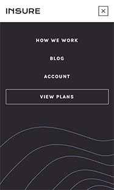
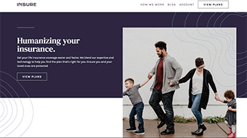

# Frontend Mentor - Insure landing page solution

This is a solution to the [Insure landing page challenge on Frontend Mentor](https://www.frontendmentor.io/challenges/insure-landing-page-uTU68JV8). Frontend Mentor challenges help you improve your coding skills by building realistic projects. 

## Table of contents

- [Overview](#overview)
  - [The challenge](#the-challenge)
  - [Screenshot](#screenshot)
  - [Links](#links)
- [My process](#my-process)
  - [Built with](#built-with)
  - [What I learned](#what-i-learned)
- [Author](#author)

## Overview

### The challenge

Users should be able to:

- View the optimal layout for the site depending on their device's screen size
- See hover states for all interactive elements on the page

### Screenshots:

**Mobile**


**Mobile Nav**



**Desktop**



### Links

- Solution URL: [https://github.com/tiffanyyee/insure-landing-page]
- Live Site URL: [https://tiffanyyee.github.io/insure-landing-page]

## My process

### Built with

- HTML5
- CSS3 including custom properties, Flexbox, hover states
- Mobile-first workflow / Responsive design
- JavaScript

### What I learned

Some snippets of my code learnings:

```html
<!-- Inline SVG -->

<li>
  <a href="http://www.facebook.com">
    <svg xmlns="http://www.w3.org/2000/svg" width="24" height="24"><path fill="#837D88" d="M22.675 0H1.325C.593 0 0 .593 0 1.325v21.351C0 23.407.593 24 1.325 24H12.82v-9.294H9.692v-3.622h3.128V8.413c0-3.1 1.893-4.788 4.659-4.788 1.325 0 2.463.099 2.795.143v3.24l-1.918.001c-1.504 0-1.795.715-1.795 1.763v2.313h3.587l-.467 3.622h-3.12V24h6.116c.73 0 1.323-.593 1.323-1.325V1.325C24 .593 23.407 0 22.675 0z"/></svg>
  </a>
</li>
```
```css
/* Change SVG icon color on hover */

.social-icons svg path:hover {
    fill: hsl(270, 9%, 17%);
}

/* Pseudo-element to add additional background pattern image and use of "pointer-events: none" to allow clicking through the element */

.banner::after{
  content: url('../images/bg-pattern-how-we-work-desktop.svg');
  top: 0;
  right: 0;
  display: block;
  position: absolute;
  pointer-events: none;
}
```
```js
// Hamburger menu - toggle nav display and icon

const icon = document.getElementById("icon");
const nav = document.getElementById("nav-links");
const hamburgerIcon = document.getElementById("hamburger-icon");
const closeIcon = document.getElementById("close-icon");

icon.addEventListener("click", function() {
  if (nav.style.display === "block") {
    nav.style.display = "none";
    hamburgerIcon.style.display = "block";
    closeIcon.style.display = "none";
  } else {
    nav.style.display = "block";
    hamburgerIcon.style.display = "none";
    closeIcon.style.display = "block";
  }
});
```

## Author

- Tiffany Yee - [Portfolio](https://tiffanyyee.github.io), [GitHub](https://github.com/tiffanyyee)
- Frontend Mentor - [https://www.frontendmentor.io]